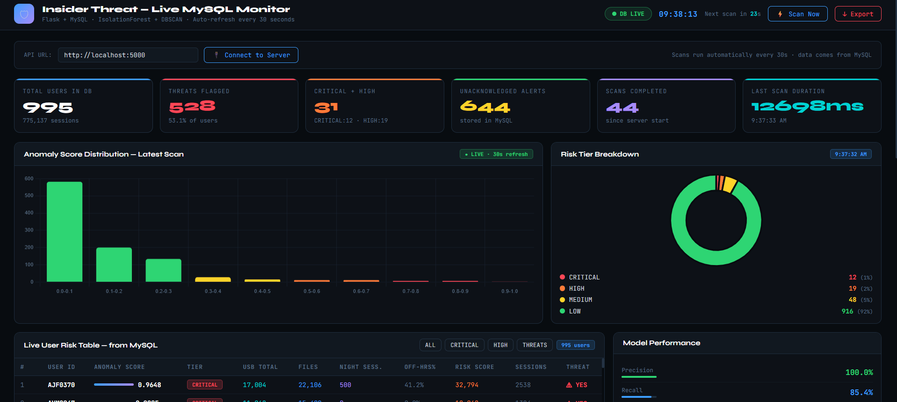
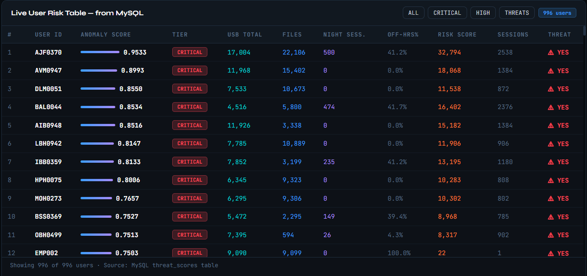
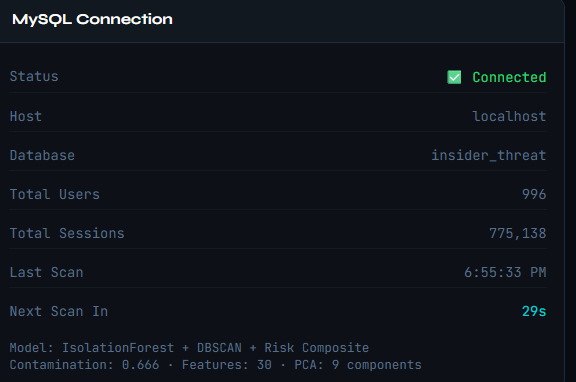

# Insider threat detection using behavioral analytics 

## Project Overview

This project presents a Hybrid Unsupervised Insider Threat Detection Framework developed using Machine Learning and Behavioral Analytics techniques. The system is designed to detect suspicious insider activities by analyzing user behavioral patterns such as login activity, file transfers, email usage, HTTP requests, and USB device interactions.

Unlike traditional rule-based security systems that mainly focus on external attacks, the proposed framework focuses on identifying anomalous behavior originating from authorized internal users. The project combines Isolation Forest, DBSCAN clustering, and a Risk Composite Engine into a hybrid ensemble model capable of detecting insider threats without requiring labeled training data.

The framework also includes a live monitoring architecture using Flask and MySQL for real-time scanning, alert generation, REST API integration, and dashboard visualization.

---

# Key Features

- Hybrid Unsupervised Machine Learning Framework
- Insider Threat Detection using Behavioral Analytics
- Isolation Forest + DBSCAN + Risk Composite Scoring
- Principal Component Analysis (PCA)
- Real-Time Threat Monitoring Dashboard
- Flask + MySQL Backend Integration
- Automated Periodic Scanning using APScheduler
- REST API-Based Architecture
- Risk Tier Classification System
- Live Alert Generation
- False Positive Reduction using Hard Rule Filtering

---

# Technologies Used

| Technology | Purpose |
|------------|---------|
| Python | Core Development |
| Flask | Backend Framework |
| MySQL | Database Management |
| Scikit-learn | Machine Learning Models |
| Isolation Forest | Statistical Anomaly Detection |
| DBSCAN | Density-Based Clustering |
| PCA | Dimensionality Reduction |
| APScheduler | Automated Scanning |
| HTML/CSS/JavaScript | Frontend Dashboard |
| Pandas & NumPy | Data Processing |

---

# Dataset Information

- Dataset: CERT Insider Threat Dataset v2.0
- Source: Carnegie Mellon University
- Total Records: 703,392+
- Users: 994
- Observation Period: 501 Days
- Learning Approach: Unsupervised Anomaly Detection

Dataset Link:
https://resources.sei.cmu.edu

---

---

# Workflow

1. User activity logs are collected from the dataset
2. Data preprocessing and feature engineering are performed
3. PCA reduces dimensionality from 30 features to 9 components
4. Isolation Forest detects statistical anomalies
5. DBSCAN identifies density-based outliers
6. Risk Composite Engine calculates behavioral risk
7. Ensemble scoring generates final anomaly score
8. Risk tiers are assigned to users
9. Threat alerts are generated
10. Dashboard displays live monitoring results

---

# Machine Learning Models

## Isolation Forest
- Detects statistical anomalies
- Ensemble Weight: 55%

## DBSCAN
- Identifies density-based outliers
- Ensemble Weight: 20%

## Risk Composite Engine
- Rule-based behavioral scoring
- Ensemble Weight: 25%

---

# Performance Metrics

| Metric | Value |
|--------|-------|
| Precision | 100% |
| Recall | 85.4% |
| F1-Score | 92.1% |
| Accuracy | 90.3% |
| AUC-ROC | 87.35% |
| False Positive Rate | 0% |

---

# Risk Tier Classification

| Risk Tier | Score Range | Action |
|-----------|-------------|--------|
| LOW | 0.00 – 0.29 | Standard Monitoring |
| MEDIUM | 0.30 – 0.54 | Increased Monitoring |
| HIGH | 0.55 – 0.74 | Investigate within 24 Hours |
| CRITICAL | 0.75 – 1.00 | Immediate Escalation |

---

# Dashboard Screenshots

## Main Dashboard

---

## Threat Monitoring Table

---

## MySQL Database

---

## Alert Feed

---

---

# Real-Time Monitoring

The system continuously scans user activity using APScheduler and updates threat scores dynamically. Threat alerts are generated automatically for HIGH and CRITICAL risk users. REST APIs are used for communication between the Flask backend and monitoring dashboard.

The backend processes incoming behavioral data, performs anomaly scoring, applies hard rule filtering, and stores threat information inside the MySQL database for live dashboard visualization.

---

